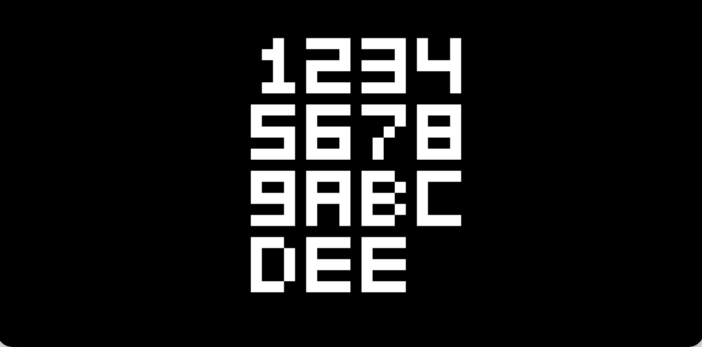

# CHIP-8 Virtual Machine

ANSI C implementation of a CHIP-8 emulator.
This project emulates the original CHIP-8 environment, allowing you to load and
run classic CHIP-8 ROMs directly in the browser.

CHIP-8 is often considered a rite of passage in emulator development
due to its simplicity and well-documented instruction set.

> [!WARNING]
> ROMs are not incuded in this repository and should be obtained legally.

## Features

* Full CHIP-8 CPU emulation (opcodes, registers, memory, stack)
* Keyboard input mapping for modern keyboards
* Browser-based execution (no installation required)

## Keyboard Mapping

CHIP-8 originally used a 16-key hexadecimal keypad.
This project maps it to a standard keyboard layout:

```
Original CHIP-8        Mapped Keyboard
1 2 3 C                1 2 3 4
4 5 6 D                Q W E R
7 8 9 E                A S D F
A 0 B F                Z X C V
```

## UI & Assets

Online website uses:

* **Bootstrap Icons** for UI elements [Bootstrap Icons](https://icons.getbootstrap.com/icons?utm_source=chatgpt.com)
* **SN Pro font** for typography [Google Fonts – SN Pro](https://fonts.google.com/specimen/SN+Pro?utm_source=chatgpt.com)

## Resources

* Awesome CHIP-8: [Awesome CHIP-8](https://chip-8.github.io/links/?utm_source=chatgpt.com)
* CHIP-8 Wikipedia: [CHIP-8 Wikipedia](https://en.wikipedia.org/wiki/CHIP-8?utm_source=chatgpt.com)

## Screenshots

| UFO (pic. 1) |  UFO (pic. 2) | Breakout |
| ---- | ---- | ---- |
|  |  |  |

| Airplane |  8ceattorny | Fifteen |
| ---- | ---- | ---- |
|  |  |  |
